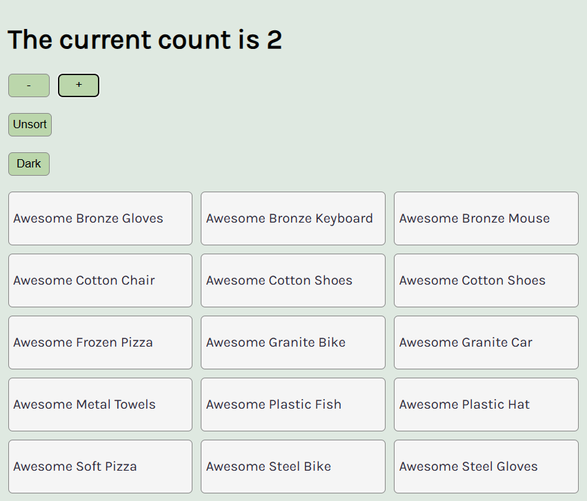

# Code Splitting

## Description
This is an exercise in which **code splitting** is used to conditionally import "heavy" code only if/when needed.

Dynamic **import()** in combination with **React.lazy()** are used to accomplish this.

 

  
## Technologies
- React

## Live link
This implementation is not deployed anywhere. 
